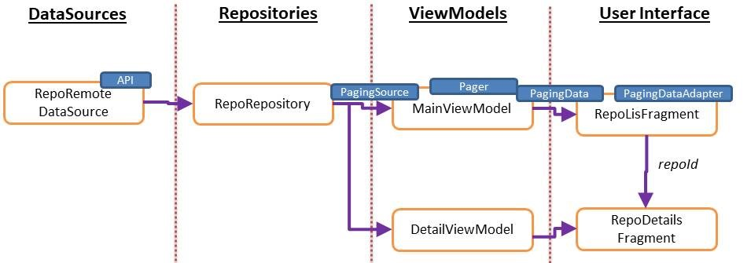
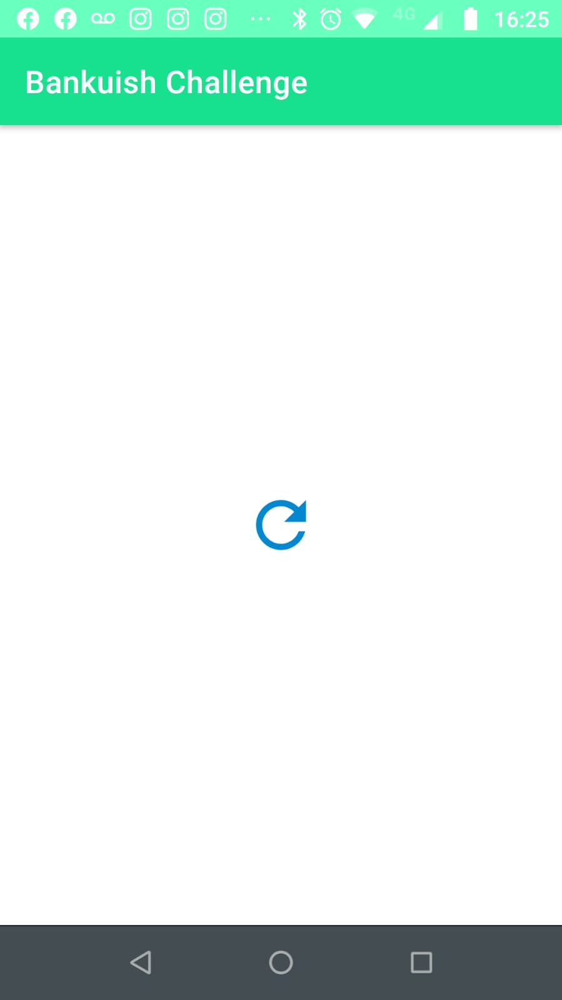
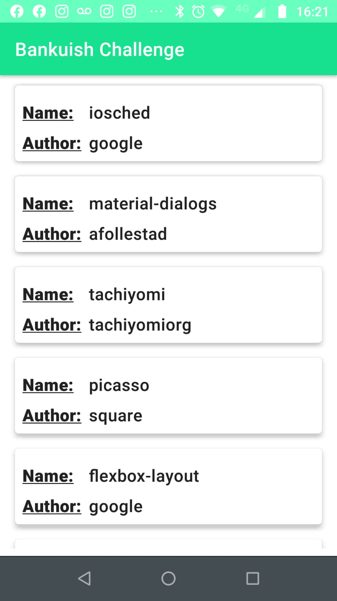
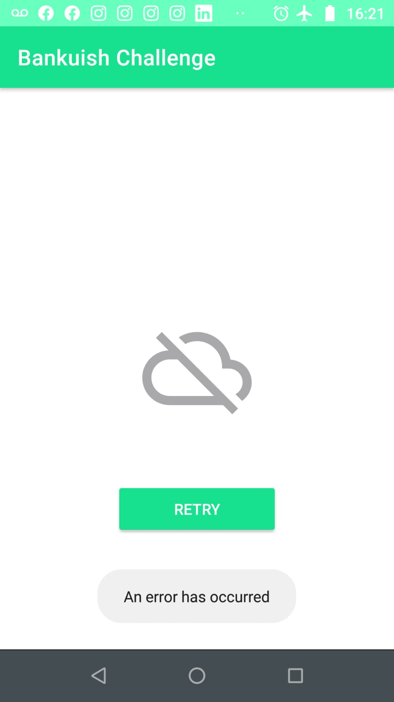
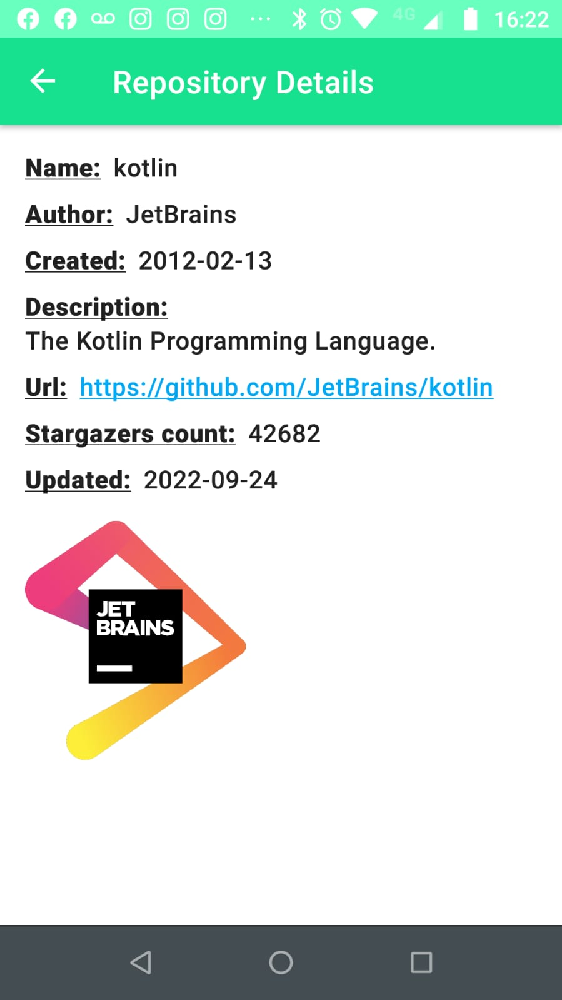
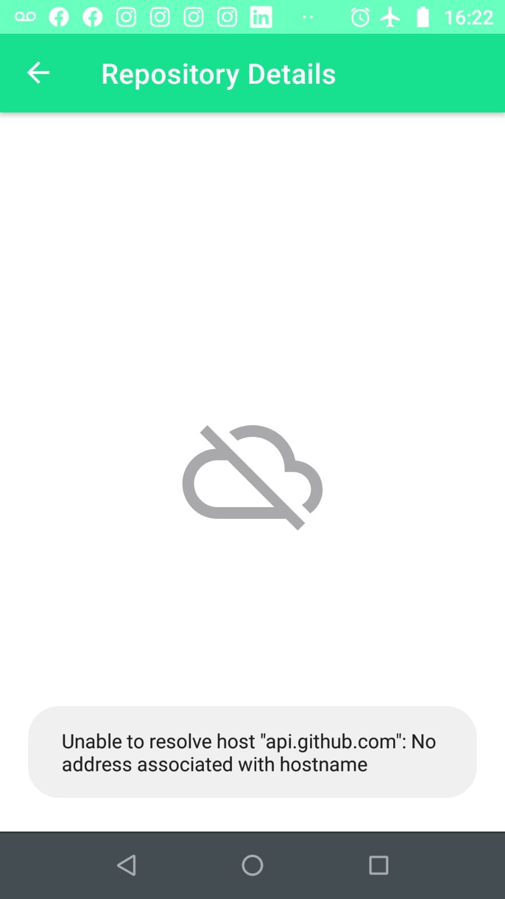

GitHubApiSearch App
===================================

Overview
--------------
An app that consumes a REST API from GitHub and displays the results on the UI.

The HomeFragment uses a recyclerView to display a list of GitHub repositories in kotlin:language. 

The app gets the first page of the service, and as the user scrolls down, it requests more pages using Paging Library.

When the user clicks on an item from the list, a DetailFragment is shown displaying repository details.

Network errors were handled.

A retry button is also shown in the HomeFragment after an error.
 
Unit tests
--------------
* DetailViewModelTests
* API service test using a mockServer and a local .json file

Instrumentation tests
--------------
* NavigationTests using the TestNavHostController

Architecture: MVVM
--------------

GitHubApiSearch App
===================================

Overview
--------------
An app that consumes a REST API from GitHub and displays the results on the UI.

The HomeFragment uses a recyclerView to display a list of GitHub repositories in kotlin:language. 

The app gets the first page of the service, and as the user scrolls down, it requests more pages using Paging Library.

When the user clicks on an item from the list, a DetailFragment is shown displaying repository details.

Network errors were handled.

A retry button is also shown in the HomeFragment after an error.
 
Unit tests
--------------
* DetailViewModelTests
* API service test using a mockServer and a local .json file

Instrumentation tests
--------------
* NavigationTests using the TestNavHostController

Architecture: MVVM
--------------

Language 
--------------
Kotlin

Screenshots
--------------
&ensp;

&ensp;

Purpose
--------------
This code demonstrates how I implemented:

* Custom theme
* Navigation Component and navArgs
* RecyclerView and DiffUtils
* Paging Library
* Coroutines
* Retrofit, Moshi and Coil
* ViewModel, LiveData, Flow
* Repository Pattern, RemoteDataSource
* Wrappers for Repository results and Operation States
* Unit Testing with Mockito and a Mockserver
* Instrumentation Testing with TestNavHostController and Espresso

Other tools used:

* JSON To Kotlin Class Plugin (JsonToKotlinClass)
* Postman (API client tester)

Getting Started
---------------

1. Download and run the app.

## Developed By

Patricio Conti